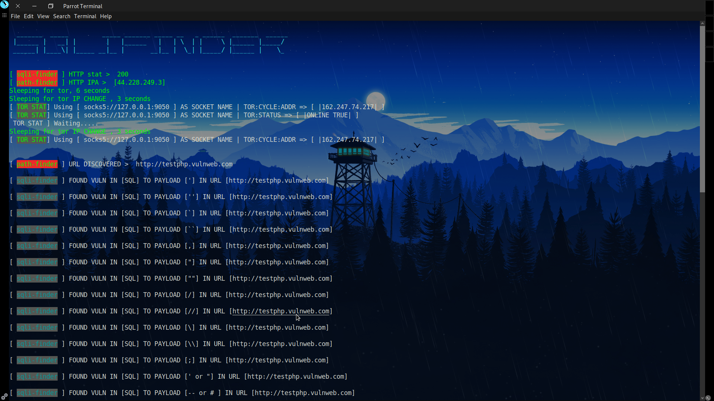

```
 _______  _____         _____ _______ _____ __   _ ______  _______  ______
 |______ |   __| |        |   |______   |   | \  | |     \ |______ |_____/
 ______| |____\| |_____ __|__ |       __|__ |  \_| |_____/ |______ |    \_
                                                                          
```
<br>
SQLI Finder ( GO edition ) is a very simple SQLI Ajax crawler and SQL injection scanner re written and mind mapped from the original sqlifinder which is seen here https://github.com/americo/sqlifinder

installs: git clone https://github.com/ArkAngeL43/sqlifinder ; cd sqlifinder ; chmod +x ./install.sh ; ./install.sh ; clear  

<br>

# what is so special about this remake 
```
To give you a general idea of why i even remade this when it was made, at first it was a test for my skills i figured why not see my max strength in GoLang right

now and turns out i exceeded them, but then i noticed in the og scanner its just a simple listed scanner if that and crawler, it crawls a url off the target then scans tht target and continues until it hits a dead end, the issue with alot of development scripts like this is they cause a whole lot of- say unneeded noise that 

can get a person caught, so i decided to add some tor projection when constantly making requests to crawl the links, added tor socket/node changing, added tor stats, then added options where you can SQL inject every URL in a given list and keep testing and testing until well you run out. i will be honest this is not the 

most accurate but it is still some improovement to the og project, i also added signal handelers, connection testers, tor socket testers, individual scanning, a faster spider, sleep methods so tor doesnt time out on making requests etc etc and a bit more error handeling.
```
```
	Flags:
		|-target  | List a HTTPS/HTTP URL as a target     |STAT ~> String,  REQUIRED                   |
		|-domain  | List a domain name as a target        |STAT ~> String,  REQUIRED                   |
		|-base    | List a HTTP URL as a target           |STAT ~> String,  REQUIRED                   |
		|-file    | List of SQL payload injections to use |STAT ~> Boolean, NOT REQUIRED BUT SUGGESTED |
		|-tor     | Use tor to connect and crawl the URL  |STAT ~> Boolean, OPTIONAL | TRUE/FALSE      |
		|-targetl | Activate list scanning                |STAT ~> Boolean, OPTIONAL | TRUE/FALSE      |
		|-l       | Initate or open the list or URLS      |STAT ~> String,  REQUIRED |                 |
		|=========+=======================================+============================================|   
```
```
	
	All possible command usages 

	Standard:
		go run main.go -target http://testphp.vulnweb.com/index.php?id=1 -domain testphp.vulnweb.com -base http://testphp.vulnweb.com
	
	Tor:
		go run main.go -target http://testphp.vulnweb.com/index.php?id=1 -domain testphp.vulnweb.com -base http://testphp.vulnweb.com -tor
		|
		| this will crawl the URL with tor ( uses socks5:9050 ) MUST HAVE TOR SERVICE ON
		| the following output will be an example when you use the tor option
		| [ sqli-finder ] HTTP stat >  200
		| [ path-finder ] HTTP IPA >  [44.228.249.3]
		| Sleeping for tor, 6 seconds
		| Sleeping for tor IP CHANGE , 3 seconds
		| [ TOR STAT] Using [ socks5://127.0.0.1:9050 ] AS SOCKET NAME | TOR:CYCLE:ADDR => [ |51.83.131.42| ] 
		| [ TOR STAT] Using [ socks5://127.0.0.1:9050 ] AS SOCKET NAME | TOR:STATUS => [ |ONLINE TRUE| ] 
	
	Listed Scan:
		go run main.go -targetl             -l < file of urls >
		|              ^ File initiation    ^ your payload file or path    
		|
		| this will activley without tor SQL Inject any host in the file, WARNING: FILE MUST HAVE 
		| HTTP/HTTPS IF IT DOES NOT GO WILL ERROR OUT SAYING "unsupported scheme"
		| An example output is shown
		|
		| 
		| [ sqli-finder ] FOUND VULN IN [SQL] TO PAYLOAD ['] IN URL [https://www.acunetix.com/vulnerability-scanner]
		| 
		| [ sqli-finder ] FOUND VULN IN [SQL] TO PAYLOAD ['] IN URL [http://testphp.vulnweb.com]
		| 
		| [ sqli-finder ] FOUND VULN IN [SQL] TO PAYLOAD ['] IN URL [http://testphp.vulnweb.com/artists.php]
		|
		| [ sqli-finder ] FOUND VULN IN [SQL] TO PAYLOAD ['] IN URL [http://testphp.vulnweb.com/artists.php]
	
	Using payload lists:
		go run main.go -target http://testphp.vulnweb.com/index.php?id=1 -domain testphp.vulnweb.com -base http://testphp.vulnweb.com -file < your file of payloads >
		|
		|
		|this will open the file then use those payloads in the SQL injection, if you do not use this option it is fine, this tool has its own built in SQL payloads
```
<h1> INSTALLS </h1> 
<br>


